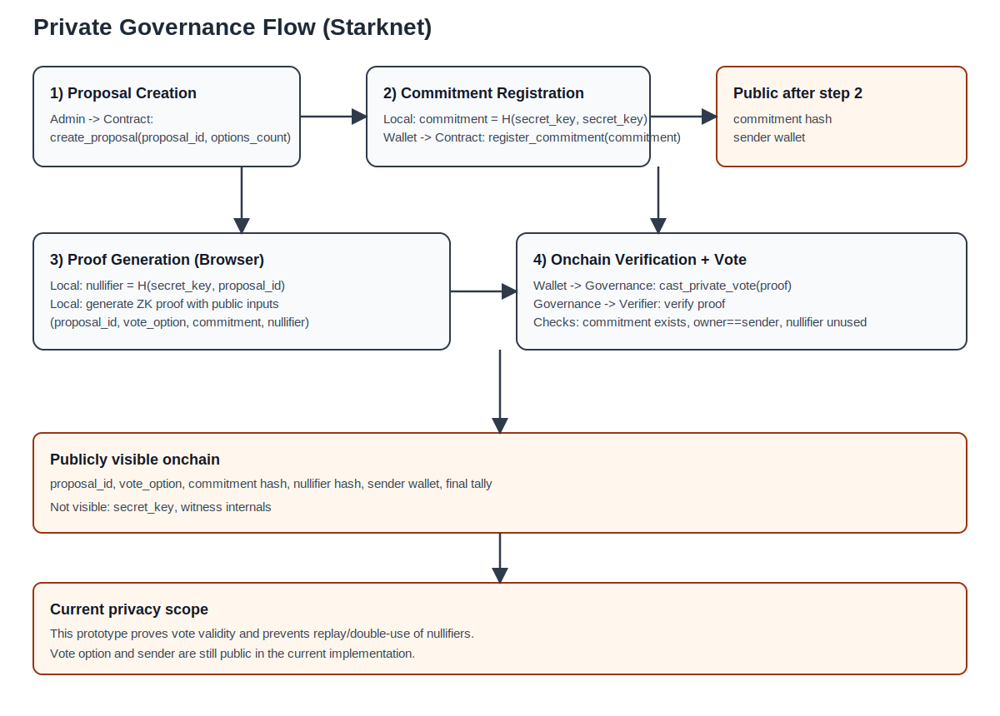
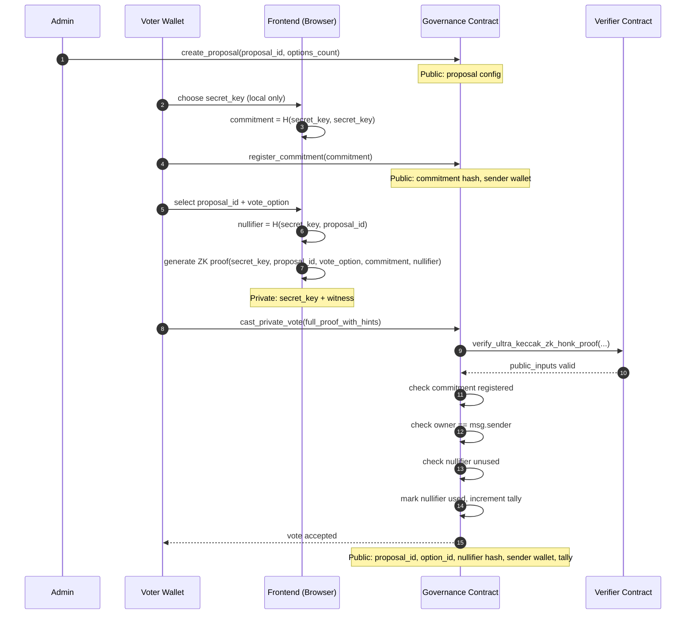

# private-goverence

## Hackathon submission description (under 500 words)

`private-goverence` is a privacy-preserving governance prototype on Starknet. It lets users vote on proposals without revealing which option they selected, while still enforcing one valid vote per user per proposal.

Most onchain governance systems are transparent by default: wallet identity, voting choice, and vote history are fully visible. That transparency is useful for auditability, but it can enable social pressure, retaliation, and vote buying. This project explores a middle ground: public verifiability of vote validity, private choice of vote content.

The core design uses a zero-knowledge circuit (Noir) and a Starknet verifier flow (UltraHonk + Garaga-generated Cairo verifier). A voter registers a commitment derived from a private secret. During voting, the app generates a proof in-browser that shows:

1. the voter knows the secret linked to a registered commitment,
2. the vote is for a valid proposal and option,
3. the nullifier is correctly derived for this proposal.

The contract verifies this proof and accepts the vote only if:

1. the commitment exists,
2. the nullifier has not been used,
3. option bounds are valid.

This preserves anonymity of the vote choice while preventing replay and double voting.

The implementation includes:

- Noir circuit for witness/proof constraints,
- Barretenberg proof generation,
- Garaga calldata conversion + verifier contract generation,
- Cairo governance contract with commitment and nullifier checks,
- React/Bun frontend for registration, proof generation, and vote submission.

For the Re{define} Privacy track, this project demonstrates a practical privacy primitive that can be reused beyond governance: anonymous signaling, private attestations, and sybil-resistant yet privacy-preserving participation systems on Starknet.

---

## Privacy model: commitment, nullifier, and visibility

### 1) Commitment (registration phase)

- Voter chooses a private `secret_key` (never published).
- Voter computes `commitment = poseidon(secret_key, secret_key)` locally.
- Voter calls `register_commitment(commitment)` once from their wallet.
- Contract stores `commitment -> owner wallet`.

What this gives:
- The contract can later verify that a vote comes from someone who knows the secret behind a registered commitment.
- The secret itself is never revealed onchain.

### 2) Nullifier (vote phase)

- For each proposal, voter computes `nullifier = poseidon(secret_key, proposal_id)` locally.
- During `cast_private_vote`, the proof shows the nullifier is derived correctly from the same secret.
- Contract marks that nullifier as used.

What this gives:
- One secret can vote only once per proposal.
- Reusing the same proof/nullifier fails (replay protection).
- Nullifier changes across proposals (because `proposal_id` is included), so votes across proposals are harder to link by nullifier alone.

### 3) What others can see vs cannot see

Public (visible onchain):
- proposal id and option id used for the vote,
- commitment hash and nullifier hash,
- transaction sender wallet,
- final vote tally.

Not public:
- `secret_key`,
- witness internals used to generate the proof.

Important current limitation:
- In this prototype, `vote_option` is part of public inputs and the vote transaction sender is visible. So this is currently "private secret + ZK validity + anti-replay", not full hidden-choice anonymity yet.

### 4) Why still useful

- Prevents fake votes without exposing the secret.
- Enforces one valid vote per proposal with cryptographic checks.
- Provides a base architecture that can be extended to stronger privacy (e.g., hiding option choice and decoupling sender identity from vote submission).

## Flow diagram



Static diagram above renders in VS Code/GitHub without Mermaid support.

### Mermaid source



### Flow diagram (fallback, renders everywhere)

```text
Admin
  -> Governance Contract: create_proposal(proposal_id, options_count)
  -> Public state: proposal config

Voter Wallet + Frontend
  -> Local only: choose secret_key
  -> Local only: commitment = H(secret_key, secret_key)
  -> Governance Contract: register_commitment(commitment)
  -> Public state: commitment hash + sender wallet

Voter Wallet + Frontend
  -> Local only: select proposal_id, vote_option
  -> Local only: nullifier = H(secret_key, proposal_id)
  -> Local only: generate proof(secret_key, proposal_id, vote_option, commitment, nullifier)
  -> Governance Contract: cast_private_vote(full_proof_with_hints)

Governance Contract
  -> Verifier Contract: verify proof
  -> Checks:
     1) commitment is registered
     2) commitment owner == msg.sender
     3) nullifier is unused
     4) option is in range
  -> State update: mark nullifier used, increment tally

Publicly visible after vote:
  - proposal_id
  - option_id
  - commitment hash
  - nullifier hash
  - sender wallet
  - updated tally

Never revealed:
  - secret_key
  - witness internals
```

---

Anonymous governance prototype for Starknet testnet/devnet using:
- Noir circuit for private vote proofs
- Barretenberg UltraHonk proof generation
- Garaga verifier calldata conversion
- Cairo contract with commitment registry + nullifier protection
- Bun + React frontend for admin and voting flows

## Folder structure

- `circuit`: Noir private voting circuit
- `contracts`: Cairo governance contract
- `app`: Bun frontend (proof generation + wallet interaction)

## Flow

1. Admin creates a proposal (`proposal_id`, `options_count`).
2. Voter wallet self-registers a commitment (`poseidon(secret, secret)`).
3. Voter generates a proof with public inputs:
   - `proposal_id`
   - `vote_option`
   - `commitment`
   - `nullifier = poseidon(secret, proposal_id)`
4. Contract verifies proof and checks:
   - commitment is registered
   - nullifier not used
   - option is valid
5. Vote tally increments while preserving voter anonymity.

Current anti-abuse model:
- one commitment per wallet at registration
- commitment must belong to caller when voting
- one vote per wallet per proposal
- one nullifier per proposal (prevents replay with same secret)

## Quick start

```bash
cd private-goverence
make install-app-deps
make build-circuit
make gen-vk
make gen-verifier
make build-contracts
make copy-artifacts
```

If `make gen-vk` fails with `GLIBC_*` or `GLIBCXX_*` errors from `bb`, run:

```bash
make gen-vk-docker
```

Start local chain:

```bash
make start-devnet
```

In another terminal:

```bash
cd private-goverence
make accounts-file
make declare-verifier
# then set VERIFIER_CLASSHASH in contracts/main/src/lib.cairo
make declare-main
# deploy with sncast deploy using the class hash from declare-main
```

Run app:

```bash
cd private-goverence/app
cp .env.example .env
bun run dev
```

## Environment

`app/.env.example`:

- `VITE_STARKNET_RPC`: Starknet RPC endpoint
- `VITE_GOVERNANCE_CONTRACT_ADDRESS`: deployed governance contract address

## Notes

- `circuit/Prover.toml` has a placeholder nullifier. Frontend computes correct values automatically.
- Replace `VERIFIER_CLASSHASH` in `contracts/main/src/lib.cairo` after declaring the generated verifier.
- For public testnet deployment, switch RPC/account profile in `contracts/snfoundry.toml` and app `.env`.
- If you changed contract logic, redeclare and redeploy `PrivateGoverence`, then update app `.env`.

## References used

- https://github.com/vitwit/cosmos-zk-gov
- https://thebojda.medium.com/how-i-built-an-anonymous-voting-system-on-the-ethereum-blockchain-using-zero-knowledge-proof-d5ab286228fd
- https://espejel.bearblog.dev/starknet-privacy-toolkit/
